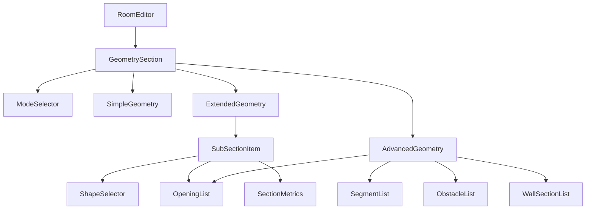

# Technical Specification: Geometry Block Refactoring & Modularization

**Date:** 2026-03-06
**Version:** 2.0 (Architectural Update)
**Status:** Ready for Implementation
**Priority:** High

---

## 1. Executive Summary

### 1.1 The Challenge
The current `RoomEditor.tsx` is a "God Component" (~2000 lines) that handles geometry, works, materials, and UI state simultaneously. In **Extended** and **Advanced** modes, the geometry configuration is scattered across multiple top-level blocks, creating a fragmented UX and making the code difficult to maintain and test.

### 1.2 The Vision
Refactor the Geometry Block into a **unified, modular, and highly interactive** component. We will shift from a "monolithic JSX" approach to a "component composition" pattern, ensuring high performance, strict type safety, and a world-class user experience.

---

## 2. Architectural Design

### 2.1 Component Decomposition
To ensure maintainability, the geometry block will be split into specialized, reusable components:



### 2.2 New Component Registry

| Component | Responsibility |
|-----------|----------------|
| `GeometrySection` | Main container, handles collapse state and mode switching logic. |
| `ModeSelector` | Pure UI for switching between Simple, Extended, and Advanced modes. |
| `SimpleGeometry` | Configuration for L×W×H and basic openings. |
| `ExtendedGeometry` | Management of complex subsections (Rect, Trapezoid, Triangle, etc.). |
| `AdvancedGeometry` | Professional tools: segments, obstacles, and wall height deltas. |
| `OpeningList` | Reusable list for Windows and Doors (Openings). |
| `GeometryMetrics` | Local metrics display for individual sections/segments. |

---

## 3. Technical Implementation Strategy

### 3.1 Custom Hook: `useGeometryState`
Extract all geometry-related logic from `RoomEditor.tsx` into a dedicated hook. This separates "How things are calculated/stored" from "How things look".

```typescript
// src/hooks/useGeometryState.ts
export const useGeometryState = (room: RoomData, updateRoom: (r: RoomData) => void) => {
  // Handlers for Simple mode...
  // Handlers for Extended mode (SubSections)...
  // Handlers for Advanced mode (Segments, Obstacles)...
  
  return {
    handlers: { /* ... */ },
    uiState: { /* collapse states */ }
  };
};
```

### 3.2 Visual Language & UX
*   **Unified Container**: All geometry settings are inside one "Room Dimensions" block with a single top-level chevron.
*   **Visual Hierarchy**: Use `SectionDivider` with icons for sub-blocks in Advanced mode.
*   **Contextual Feedback**: Show local metrics (area, perimeter) immediately within each section/segment.
*   **Animation**: Smooth transitions for collapsing sub-sections.
*   **Accessibility**: Full keyboard navigation support and ARIA labels for all inputs.

---

## 4. Target Structure (Refined)

### 4.1 Extended Mode (Composite Pattern)
A unified block containing a list of autonomous sections.
```
[▼] Room Dimensions
 ├─ [Mode Toggle: Simple | EXTENDED | Advanced]
 ├─ Height: [ 2.7 ] m
 ├─ ─── Room Sections ───
 ├─ [ Section #1: "Kitchen" | Shape: Rectangle | (x) ]
 │   ├─ Length: [ 4.0 ]  Width: [ 3.0 ]
 │   ├─ Openings: Windows (1), Doors (1) [+]
 │   └─ Metrics: 12.0 m² | 14.0 m | 32.4 m³
 ├─ [ Section #2: "Niche" | Shape: Triangle | (x) ]
 │   └─ Dimensions (Side A, B, C)
 └─ [+] Add Section
```

### 4.2 Advanced Mode (Professional Toolkit)
A centralized hub for complex room modifications.
```
[▼] Room Dimensions
 ├─ [Mode Toggle: Simple | Extended | ADVANCED]
 ├─ L: [ 5.0 ]  W: [ 4.0 ]  H: [ 2.7 ]
 ├─ ─── Segments (L-shapes/Niches) ───
 │   └─ [ Segment #1: 1.5x0.5 | (Subtract) ] [+]
 ├─ ─── Obstacles (Columns/Ducts) ───
 │   └─ [ Column #1: 0.25 m² | (Subtract) ] [+]
 ├─ ─── Wall Height Variations ───
 │   └─ [ Section #1: L=3.0, H=3.5 ] [+]
 └─ ─── Global Openings ───
     ├─ Windows [+]
     └─ Doors [+]
```

---

## 5. Performance Optimization
*   **Memoization**: Wrap `SubSectionItem` and `SegmentItem` in `React.memo` to prevent re-renders when other sections are edited.
*   **Lazy Loading**: Consider lazy-loading Advanced/Extended sub-components since they aren't used in 80% of projects.
*   **State Updates**: Use functional updates `setRoom(prev => ...)` to avoid closure-related bugs in complex lists.

---

## 6. Testing & Validation Strategy

### 6.1 Unit Tests (`vitest`)
*   `calculateSectionMetrics`: Verify area/perimeter for all shapes (Trapezoid, Triangle, etc.).
*   `useGeometryState`: Test state transitions when switching modes.

### 6.2 Integration Tests (`React Testing Library`)
*   Add a section -> Verify it appears in the list and updates the global metrics.
*   Switch mode -> Verify data is preserved but correctly hidden/shown.

### 6.3 E2E Tests (`Playwright`)
*   Complete "L-shaped room" scenario: Add 2 sections, add 1 window to each, check final cost.
*   "Column subtraction" scenario: Add obstacle, verify net wall area decreases.

---

## 7. Migration Roadmap

1.  **Step 1**: Extract `ModeSelector` and `OpeningList` (easiest to isolate).
2.  **Step 2**: Create `ExtendedGeometry` and move subsection logic.
3.  **Step 3**: Create `AdvancedGeometry` and move segments/obstacles logic.
4.  **Step 4**: Implement the `useGeometryState` hook to consolidate handlers.
5.  **Step 5**: Update `RoomEditor.tsx` to use the new `GeometrySection` component.
6.  **Step 6**: Final UI polish (spacings, dividers, transitions).

---

## 8. Risk Management

| Risk | Impact | Mitigation |
|------|--------|------------|
| Data Loss during refactoring | Critical | Rely on existing E2E tests and `storage.test.ts` to ensure data persistence. |
| Fragmented State | Medium | Use a single source of truth in `ProjectContext` or `RoomEditor` props. |
| Regression in calculations | High | Run `geometry.test.ts` after every component extraction. |

---

## 9. Definition of Done (DoD)
- [ ] `RoomEditor.tsx` size reduced by at least 30%.
- [ ] Geometry logic extracted into a custom hook.
- [ ] All geometry settings reside within a single "Room Dimensions" block.
- [ ] Visual dividers and icons implemented as per specification.
- [ ] All unit and E2E tests passing.
- [ ] No performance regressions in large rooms (10+ sections).
